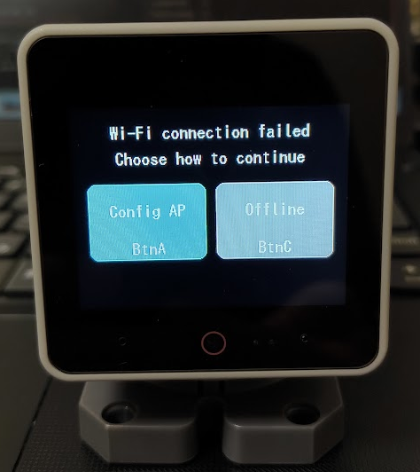
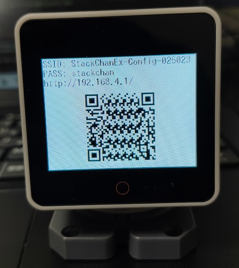
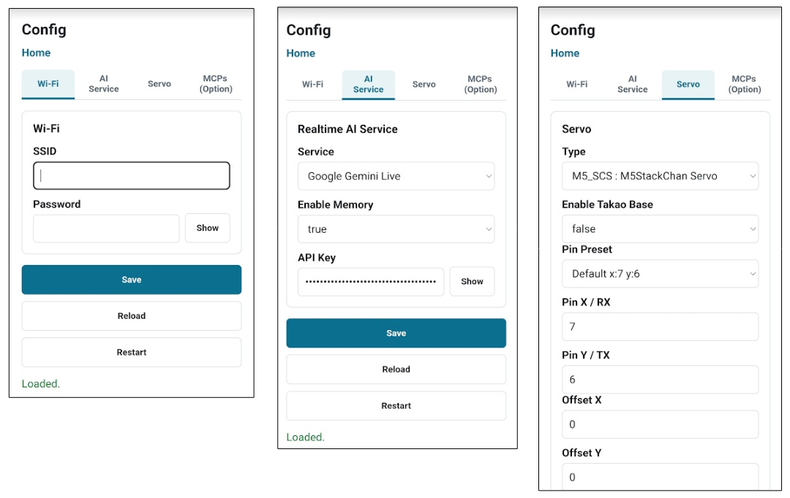

# Realtime API

- [Overview](#overview)
- [How to build](#how-to-build)
- [Setup Method 1: Web UI (Recommended)](#setup-method-1-web-ui-recommended)
- [Setup Method 2: SD Card](#setup-method-2-sd-card)
  - [YAML① (Wi-Fi、API key)](#yaml-wi-fiapi-key)
  - [YAML② (LLM)](#yaml-llm)
  - [YAML③ (Servo)](#yaml-servo)
- [How to use](#how-to-use)
  - [Real-time conversation](#real-time-conversation)
  - [Stopping and restarting servo operation](#stopping-and-restarting-servo-operation)
- [Function Calling and MCP](#function-calling-and-mcp)
- [OpenAI GPT-Live](#openai-gpt-live)

## Overview
By using Realtime API, you can enjoy conversations with response speeds closer to real time than ever before.
Compatible with OpenAI Realtime API, OpenAI GPT-Live and Gemini Live API.

## How to build
As shown below, select "env:m5stack-xxx-realtime" in the VSCode (PlatformIO) GUI, then build and upload the firmware.  

> Note:  
> If this is your first time opening and building the project with PlatformIO, see [Basic Usage 2.2. Build & Flash](basic_usage_en.md#22-build--flash).


## Setup Method 1: Web UI (Recommended)
This method uses the Web UI and does not require an SD card. Follow these steps to configure the device.

① Turn on the M5Stack device.

② Because Wi-Fi is not configured on first startup, a mode selection screen like the one below appears.  
　Select "Config AP" to start the device in AP mode.

- Config AP: Starts the device in AP mode so you can configure it using the Web UI  
- Offline: Starts the device in offline mode

　

③ After the device starts in AP mode, a screen like the one below appears. Connect your smartphone or PC to the displayed SSID, then access the Config page using the displayed URL or QR code.

　

④ Enter the settings on each tab of the Config page, then click Save.
> Note:  
> After completing all tabs, you only need to click Save once to save the settings from every tab.

- Wi-Fi: SSID and password for the Wi-Fi access point to connect to
- AI Service: Realtime API selection and API key
- Servo: Servo type and pin number
- MCPs (Optional): MCP server settings  

　

⑤ Click Restart to restart the M5Stack device and apply the settings.

## Setup Method 2: SD Card
This is the conventional method of configuring the device with YAML files on an SD card.
Save the following three YAML files to the SD card, insert it into the M5Stack device, and restart the device to apply the settings.

> Note:  
> AtomS3R does not support SD cards, so write the YAML files to SPIFFS instead. See [AtomS3R](./atoms3r.md) for instructions.

### YAML① (Wi-Fi、API key)
SD card folder：/yaml  
File name：SC_SecConfig.yaml

Set the Wi-Fi password and the Open AI API key (aiservice). STT and TTS are not used, so no settings are required.

```yaml
wifi:
  ssid: "********"
  password: "********"

apikey:
  stt: "********"       # ApiKey of SpeechToText Service (OpenAI Whisper/ Google Cloud STT 何れかのキー)
  aiservice: "********" # ApiKey of AIService (OpenAI ChatGPT / Gemini)
  tts: "********"       # ApiKey of TextToSpeech Service (VoiceVox / ElevenLabs / OpenAI 何れかのキー)
```

### YAML② (LLM)
SD card folder：/app/AiStackChanEx  
File name：SC_ExConfig.yaml

Select "0:ChatGPT", "3:Gemini" or "5:GPT-Live" as the LLM. For GPT-Live settings, see [OpenAI GPT-Live](#openai-gpt-live).  
Set enableMemory=true to enable long-term memory (recording summaries in SPIFFS).  
For details about long-term memory, see 3. Personalization in [Basic Usage](basic_usage_en.md).

```yaml
llm:
  type: 0               # 0:ChatGPT  1:ModuleLLM  2:ModuleLLM(Function Calling)  3:Gemini  5:GPT-Live
  enableMemory: true    # true to enable long-term memory
```

### YAML③ (Servo)
SD card folder：/yaml  
File name：SC_BasicConfig.yaml

Configure the servo type, port, etc. according to [Basic Usage  2.1.Initial Setup with YAML](./basic_usage_en.md#sc_basicconfigyaml). If you are not using servos, you can omit this.

## How to use
### Real-time conversation
① After starting M5Core and the avatar is displayed, the text in the speech bubble will change from "Connecting..." to "Please touch."

② When you touch the top of the M5Core screen (around the avatar's forehead), the speech bubble will change to "Listening..." and real-time conversation will begin (Touch again to stop real-time conversation).

> Note:  
> On AtomS3R, the screen itself is a physical button, so press the center of the screen a little firmly.

③ If there is no conversation for more than 30 seconds, the real-time conversation will end and the speech bubble will return to "Please touch."

### Stopping and restarting servo operation
You can stop and resume servo operation by touching near the center of the M5Core screen.

## Function Calling and MCP
Function calling and MCP implemented using function calling can also be used. By default, Function Calling enables the clock and alarm functions, allowing you to respond to requests such as "What time is it now?" or "Set an alarm for three minutes". For MCP, you need to start the MCP server on a Linux PC and configure the destination MCP server with YAML. For details, see [here](mcp.md).

## OpenAI GPT-Live
Talk with OpenAI's full-duplex voice model GPT-Live (`gpt-live-1`). Select "OpenAI GPT-Live" as the Service on the AI Service tab of the Web UI, or set `type: 5` in SC_ExConfig.yaml. Use an OpenAI API key.

```yaml
llm:
  type: 5
  enableMemory: true
  liveModel: ""          # GPT-Live model. Blank uses gpt-live-1
  delegationModel: ""    # Backend model that runs Function Calling etc. Blank uses gpt-5.6-luna
  liveVoice: ""          # Voice. Blank uses marin
```

In the Web UI, the Live Model / Delegation Model / Voice fields appear when "OpenAI GPT-Live" is selected as the Service.

Differences from OpenAI Realtime:
- GPT-Live is billed by connection time ($0.05/min, billed per second), so it does not stay connected. After startup the speech bubble shows "Please touch". Touch the top of the screen to start a conversation ("Connecting..." -> "Listening...").
- The conversation ends after 30 seconds without interaction, or when you touch the top of the screen during a conversation.
- The microphone is stopped while Stack-chan is speaking, because M5Stack cannot use the microphone and speaker at the same time. You cannot interrupt Stack-chan while it is speaking.
- If GPT-Live makes a backchannel response (e.g. "uh-huh") while you are speaking, it is shown in the speech bubble instead of being played.
- Function Calling and MCP are executed by the delegation model (delegationModel), which is billed separately.
- Flicking left or right to switch to another screen during a conversation ends the conversation.
- Combining with TTS (`REALTIME_API_WITH_TTS`) is not supported. If `type: 5` is specified in that build, OpenAI Realtime is used instead.
